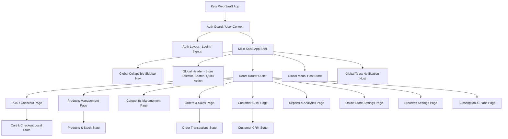

# 02 — Application Architecture Map

## Shell Component Structure
- **AppShell**: Root container with left navigation, top bar, dynamic viewport, modal host, toast host.
- **Sidebar**: Primary left-hand navigation bar supporting 9 primary routes and active highlight indicators.
- **Topbar**: Header containing Store Name, Quick Search input, Notification bell, and "+ Quick Sale" CTA button.
- **ModalHost**: Centralized portal rendering active modals dynamically based on `modalStore` state.
- **ToastHost**: Floating notification overlay for success messages, error warnings, and state updates.
